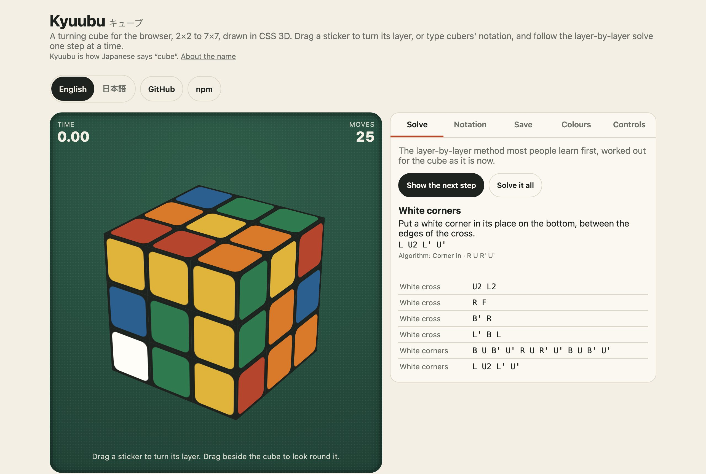
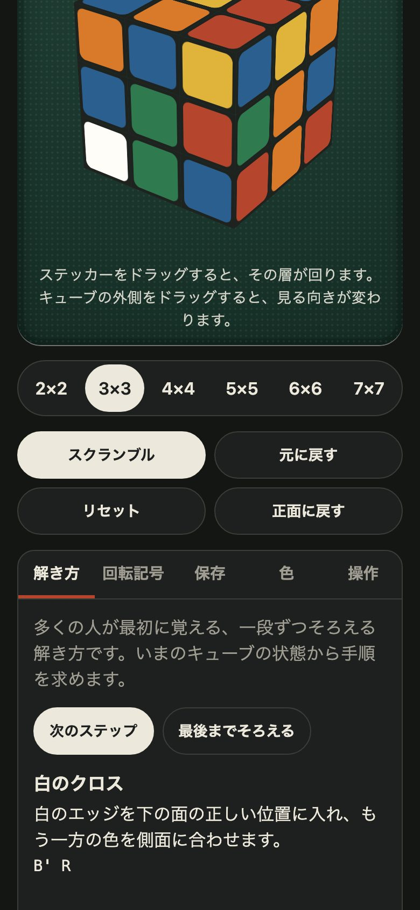

<h1 align="center">Kyuubu <sub>キューブ</sub></h1>

<p align="center"><strong>A turning cube for the browser, with a solve you can follow.</strong><br>
2×2 to 7×7, drawn in plain CSS 3D. Turn it by drag, touch, wheel, keys or cubers' notation; scramble it from a seed; and watch the layer-by-layer method solve it one named step at a time.</p>

<p align="center">
  <a href="https://github.com/johnmorrisdotca/kyuubu/actions/workflows/ci.yml"></a>
  <a href="https://www.npmjs.com/package/@johnmorrisdotca/kyuubu"></a>
  <a href="./LICENSE"></a>
  
  
</p>

<p align="center"><a href="https://johnmorrisdotca.github.io/kyuubu/"><strong>Turn a cube →</strong></a></p>

<p align="center">
  
  
</p>

A 3D cube simulator, a cube model, a scramble generator and a beginner's
solver for the twisty puzzle everybody knows, from the 2×2 to the 7×7.

- **What is different.** The cube is drawn in CSS 3D, with no canvas and no
  WebGL, so it is sharp at any size and a screen reader is told what it is.
  Under it is a plain model: a cube is a string, a turn is a pure function.
  And the solve it shows is the one a person learns, step by named step.
- **What it costs a project.** Nothing: no dependencies, and one import.

## A cube in 30 seconds

```sh
npm install @johnmorrisdotca/kyuubu    # or pnpm add, or yarn add
```

```ts
import { cubeSolved, movesNotation, randomScramble, seededRandom, solveSteps, solvedCube, turnAll } from "@johnmorrisdotca/kyuubu";

const scramble = randomScramble(3, 25, seededRandom("club night"));
movesNotation(scramble, 3);                        // "B L' S' U' F' R2 B R U2 B' R2 …": the same for everyone with the seed
const cube = turnAll(solvedCube(3), 3, scramble);  // a cube is a string of 54 letters
const steps = solveSteps(cube, 3)!;                // 17 steps: hold, white cross, white corners, …
cubeSolved(turnAll(cube, 3, steps.flatMap((step) => step.moves)), 3);   // true
```

On a page, one line draws a cube a person can turn:

```ts
import { CubeView } from "@johnmorrisdotca/kyuubu";

new CubeView(document.getElementById("cube"), { size: 3, keyboard: "page" });
```

And from a terminal, on Linux, macOS or Windows:

```sh
npx @johnmorrisdotca/kyuubu --seed table   # D' R2 U' F2 L' S L F' R E' B' R2 D S' R' E' B2 L' B' D2 F' E S U' M'
```

Or with nothing to install, [turn a cube in the demo](https://johnmorrisdotca.github.io/kyuubu/).

## Who it is for

- **Puzzle and game sites.** A cube that works by mouse, finger and keyboard,
  at any size from 2×2 to 7×7, with every turn handed to your code and a
  state small enough to store in a column.
- **Speedcubing tools.** Scrambles from a seed (`--seed "club night"`), moves
  read and written in notation (`R U R' U'`), and a check that a solve solves
  its scramble, in the browser, on a server or in a terminal.
- **Teaching.** The beginner's layer-by-layer method for any 2×2 or 3×3, as
  steps with names, reasons and the algorithm each one uses, in English and
  Japanese.
- **Anybody who wants one on a page.** Give an element a size, and there is a
  cube in it.

"Rubik's Cube" is a trademark of its owner. Kyuubu is not affiliated with or
endorsed by them; it is a turning cube of its own, worked out from geometry.

## Use it in your project

Kyuubu is three things, each usable without the others: **an API** of plain
functions (turn, read notation, scramble, solve, save), **a view** you put in
any element, and **a React component** that wraps the view.

The view fills the element it is given, so that element needs a size and a
position (`relative` or `absolute`).

### 1. The API alone

```ts
import { cubeSolved, movesNotation, parseMoves, solvedCube, turnAll, undoAll } from "@johnmorrisdotca/kyuubu";

const moves = parseMoves("R U R' U'", 3);          // the turns, or null where any of it is not one
if (moves !== null) {
  const cube = turnAll(solvedCube(3), 3, moves);   // "UULUUFUUFRRUBRRURRFFDFFUFFFDDRDDDDDDBLLLLLLLLBRRBBBBBB"
  cubeSolved(cube, 3);                             // false
  movesNotation(undoAll(moves), 3);                // "U R U' R'": the turns that take it back
  cubeSolved(turnAll(cube, 3, undoAll(moves)), 3); // true
}
```

It has no DOM in it, so it runs the same on a server: scramble there, send
the scramble, and check the moves a player sends back.

### 2. The view, in plain HTML

```html
<div id="cube" style="width: 300px; height: 300px; position: relative"></div>
<p id="turned"></p>
<script type="module">
  import { CubeView, moveNotation } from "./node_modules/@johnmorrisdotca/kyuubu/dist/index.js";

  new CubeView(document.getElementById("cube"), {
    size: 3,
    keyboard: "page",
    onTurn: (move) => (document.getElementById("turned").textContent = moveNotation(move, 3)),
  });
</script>
```

The files are ES modules and need no build. With a bundler, import from
`@johnmorrisdotca/kyuubu` as everywhere else on this page.

### 3. React

```tsx
import { useState } from "react";
import { createRoot } from "react-dom/client";
import { moveNotation } from "@johnmorrisdotca/kyuubu";
import { Kyuubu } from "@johnmorrisdotca/kyuubu/react";

function App() {
  const [turned, setTurned] = useState("");
  return (
    <>
      <Kyuubu size={3} keyboard="page" style={{ maxWidth: 300 }} onTurn={(move) => setTurned(moveNotation(move, 3))} />
      <p id="turned">{turned}</p>
    </>
  );
}
createRoot(document.getElementById("app")).render(<App />);
```

The component takes the view's options as props, plus `className`, `style`
and any `data-*` for its `<div>`. With no `className` the box is a square as
wide as its container. The cube is made in the browser after the first
render, so server rendering draws an empty box and nothing needs a provider.
In Next.js, use it from a client component (`"use client"`).

### 4. Vue

```vue
<script setup>
import { onBeforeUnmount, onMounted, ref } from "vue";
import { CubeView, moveNotation } from "@johnmorrisdotca/kyuubu";

const box = ref(null);
const turned = ref("");
let cube;
onMounted(() => {
  cube = new CubeView(box.value, { size: 3, keyboard: "page", onTurn: (move) => (turned.value = moveNotation(move, 3)) });
});
onBeforeUnmount(() => cube?.destroy());
</script>

<template>
  <div ref="box" style="width: 300px; height: 300px; position: relative"></div>
  <p id="turned">{{ turned }}</p>
</template>
```

### 5. Svelte and Angular

The same one call in the framework's mount hook, and `destroy()` on the way
out:

```svelte
<script>
  import { onMount } from "svelte";
  import { CubeView, moveNotation } from "@johnmorrisdotca/kyuubu";

  let box;
  let turned = $state("");
  onMount(() => {
    const cube = new CubeView(box, { size: 3, keyboard: "page", onTurn: (move) => (turned = moveNotation(move, 3)) });
    return () => cube.destroy();
  });
</script>

<div bind:this={box} style="width: 300px; height: 300px; position: relative"></div>
<p id="turned">{turned}</p>
```

```ts
// Angular: a standalone component
@Component({
  selector: "check-root",
  template: `<div #box style="width: 300px; height: 300px; position: relative"></div><p id="turned">{{ turned() }}</p>`,
})
class App implements OnDestroy {
  private box = viewChild.required<ElementRef<HTMLElement>>("box");
  private cube?: CubeView;
  turned = signal("");
  constructor() {
    afterNextRender(() => {
      this.cube = new CubeView(this.box().nativeElement, { size: 3, keyboard: "page", onTurn: (move) => this.turned.set(moveNotation(move, 3)) });
    });
  }
  ngOnDestroy() {
    this.cube?.destroy();
  }
}
```

Each of the five is built from the packed tarball, opened in Chromium and
WebKit, and turned with a key by `scripts/check-frameworks.mjs` before a
release names it. The examples above are the ones it builds.

### What a developer gets

- **Typed results.** TypeScript types for everything, with a doc comment on
  every export.
- **A random source you can replace.** `randomScramble` takes any function
  that returns a number from 0 up to 1. `seededRandom("any text")` is one
  that gives the same numbers everywhere.
- **No dependencies**, ES modules that also load under `require` (Node 22 and
  later), and `sideEffects: false`, so a bundler drops what you do not import.
- **Sizes.** The model, notation and scrambles alone are about 4 kB minified
  (2 kB gzipped) once a bundler has shaken the rest out. With the solver it
  is about 10 kB (4 kB gzipped). The view is about 17 kB (6 kB gzipped), and
  everything together 43 kB (16 kB gzipped).
- **Where it runs.** Every current browser with CSS 3D transforms and Pointer
  Events. The model, the solver and the command line run in Node 20 and
  later.

## The name

*Kyuubu* (キューブ) is the English word "cube" as Japanese writes it: a
borrowed word, spelled in katakana, the script Japanese uses for words taken
from other languages. It is said in three beats, kyu-u-bu, the middle one
only the vowel held longer, which is what the mark ー shows. Written more
formally in the Latin alphabet it is *kyūbu*; the package spells the long
vowel out, so that the name needs no accent to type.

## Where it comes from, and where it is used

Kyuubu was built for [Itsutsu](https://itsutsu.com), a site for board games,
puzzles, card games and dice games played at your own pace. *Itsutsu* (五つ) is
Japanese for "five", after five in a row, the game the site began with. The
site wanted a cube that worked on a phone without a canvas, that it could
check on the server move by move, and that could show a beginner what to do
next. Once that existed it seemed worth sharing.

### Used by

- [Itsutsu](https://itsutsu.com), for its cube.

That is the whole list so far. Using Kyuubu in something? Open an *Add my
project* issue and we will add you.

### The family

Kyuubu has siblings, each made for the same site, each MIT, each at
[github.com/johnmorrisdotca](https://github.com/johnmorrisdotca):

- [Korokoro](https://github.com/johnmorrisdotca/korokoro) (コロコロ, the sound
  of something small rolling along): a dice roller and a dice notation
  parser, with the exact odds of every roll.
- [Hitotsu](https://github.com/johnmorrisdotca/hitotsu) (一つ, "one"): a
  colour-card shedding game for two to eight, with the house rules as options
  and a computer player.
- [Toranpu](https://github.com/johnmorrisdotca/toranpu) (トランプ, the everyday
  Japanese word for a deck of playing cards): ten card games as pure
  TypeScript rules, with computer players.
- [Tane](https://github.com/johnmorrisdotca/tane) (種, a seed, the kind you
  plant): seeded random numbers and daily seeds.
- [Narabe](https://github.com/johnmorrisdotca/narabe) (並べ, "line them up"):
  one rules engine for forty-eight abstract board games.
- [Tenka](https://github.com/johnmorrisdotca/tenka) (天下, "under heaven"):
  world conquest for two to six, on a map of the real world.
- [Kumimoji](https://github.com/johnmorrisdotca/kumimoji) (組み文字, "letters
  put together"): the crossword tile race, in English and Japanese.

## Features

- **Any size, one model.** The 2×2 up to the 7×7 run on the same few lines of
  geometry. There are no hand-written tables of face cycles.
- **Real 3D in plain CSS.** Every sticker is an element placed with a
  `matrix3d`. While a layer turns, the inside of the cube shows as plastic,
  never as a hole.
- **Every way of turning it.** Drag a sticker; roll the wheel over one; use a
  finger; press the keys cubers write with; or hand it notation from code.
- **A plain model under the view.** A cube is a string of `6 × n × n` letters
  and a turn is a pure function, so a cube is easy to store, send, snapshot
  in a test, or check again on a server.
- **Notation in and out.** It reads and writes `R U R' U'`, `2R2`, `M'`, `x`
  and the rest.
- **Scrambles from a seed.** The same seed gives the same scramble in every
  browser and on every server, so a club can race one scramble.
- **A solve you can follow.** The beginner's layer-by-layer method for any
  2×2 or 3×3: each step with its name, what it is for, its turns and the
  algorithms it uses.
- **Export and import.** A solve, scramble and moves together, as JSON that
  reads back in, as a few lines of plain text, or as CSV for a spreadsheet.
- **Themes.** Every colour is an option and a CSS custom property, with
  three looks included and a call to change them on a cube already drawn.
- **A command line.** `kyuubu --seed table` in a terminal on Linux, macOS or
  Windows: scrambles, turns, a check and a solve, as text or JSON.
- **English and Japanese**, for everything the package says to a person.
- **Accessible.** The cube is a labelled `application`, takes the keyboard,
  and every turn can be made without a pointer.

## Notation

Kyuubu reads and writes the notation cubers use.

| Written | Means |
| --- | --- |
| `R` `L` `U` `D` `F` `B` | A quarter turn of that face, clockwise as seen from that face |
| `R'` | The same face, counter-clockwise |
| `R2` | A half turn |
| `2R`, `3U'` | The 2nd or 3rd layer in from that face alone (big cubes), up to `9R` |
| `M` `E` `S` | The middle layer of an odd cube, turning like `L`, `D` and `F` |
| `x` `y` `z` | The whole cube, turning like `R`, `U` and `F` |

`parseMoves(text, n)` returns `null` for anything the cube of that size
cannot turn, so input can be checked before it is used: `M` on a 2×2, `4R`
on a 3×3, or a letter that is not a turn.

Not read: wide turns (`Rw`, `r`), which turn two layers at once. Write them
as two turns, `R 2R`.

## Controls

| Input | On a sticker | Beside the cube |
| --- | --- | --- |
| Drag or swipe | Turns the layer carrying that sticker, the way you moved | Looks at the cube from anywhere |
| Wheel | Turns the sticker's row | Turns the view sideways |
| <kbd>Ctrl</kbd> + wheel | Turns the sticker's column | Tips the view up or down |
| <kbd>Shift</kbd> + wheel | Turns the sticker's face | |

| Key | Turn |
| --- | --- |
| <kbd>R</kbd> <kbd>L</kbd> <kbd>U</kbd> <kbd>D</kbd> <kbd>F</kbd> <kbd>B</kbd> | Face clockwise; with <kbd>Shift</kbd>, counter-clockwise |
| <kbd>M</kbd> <kbd>E</kbd> <kbd>S</kbd> | Middle layer (odd cubes) |
| <kbd>X</kbd> <kbd>Y</kbd> <kbd>Z</kbd> | Whole cube |
| <kbd>2</kbd> to <kbd>9</kbd>, then a face | That many layers in: <kbd>2</kbd> <kbd>R</kbd> is `2R` on a 4×4 |
| Arrow keys | Look around |

Keys are heard when the cube has focus (`keyboard: "focus"`, the default) or
anywhere on the page (`"page"`), never while the reader is typing in a field.

## The model

A **state** is `6 × n × n` letters, one a sticker. The faces come in the
order `U R F D L B`, and each face is read in rows as it is seen from
outside. A letter names the face its sticker belongs to when the cube is
solved, so a solved 2×2 is `UUUURRRRFFFFDDDDLLLLBBBB`.

A **move** is `{ axis, layer, turns }`:

- `axis`: `0` (x, to the right), `1` (y, up) or `2` (z, towards you).
- `layer`: counted from the axis's negative side, `0` to `n − 1`, or `"all"`
  for the whole cube.
- `turns`: `1`, `2` or `3` quarter turns by the right-hand rule.

```ts
parseMove("R", 3);      // { axis: 0, layer: 2, turns: 3 }
parseMove("2R'", 4);    // { axis: 0, layer: 2, turns: 1 }
parseMove("x", 3);      // { axis: 0, layer: "all", turns: 3 }
encodeCubeMoves(parseMoves("R U2 F'", 3)!);   // "x23y22z21": three characters a move, for a column
```

Every function returns a new state and leaves the one it was given alone.
`cubeSolved` asks only that every face be one colour, so a solved cube turned
whole in the hand is still solved.

## A solve a person can follow

`solveSteps(state, n)` works out the layer-by-layer solve most people learn
first, for a 2×2 or 3×3 in any state. It returns `null` for other sizes.

```ts
import { movesNotation, parseMoves, solveSteps, solvedCube, stageName, stageSays, turnAll } from "@johnmorrisdotca/kyuubu";

const cube = turnAll(solvedCube(2), 2, parseMoves("R U2 F'", 2)!);
for (const step of solveSteps(cube, 2)!) {
  console.log(stageName(step.stage), movesNotation(step.moves, 2));
}
// Hold it      x'
// White layer  F'
// White layer  F U F'
// White layer  F R2 F'

stageSays("whiteLayer");          // "Put a white corner in its place on the bottom."
stageName("whiteLayer", "ja");    // "白の面"
```

- The cube is held with white on the bottom. The `hold` step, if one is
  needed, is the whole-cube turn that puts it there.
- The 3×3 goes white cross, white corners, middle layer, yellow cross, yellow
  face, yellow corners, yellow edges. The 2×2 goes white layer, yellow face,
  yellow corners. A stage that places its pieces one at a time is a step for
  each piece.
- Each step's `parts` split it into lining-up turns and whole algorithms, so
  a page can say which algorithm to use and when. `SOLVE_ALGORITHMS` gives
  each one in notation, and `algorithmName` names it in either language.
- Every step is a short search over the moves a beginner is taught, so it
  reads like the method, not like a computer's shortest solve: a scrambled
  3×3 comes to something over a hundred moves, and takes a millisecond or two
  to work out.
- "White" and "yellow" are the up and down faces' letters, `U` and `D`,
  whatever colours your theme gives them.
- A state no cube can reach (a corner twisted, two stickers swapped) has no
  solve: `solveSteps` throws, and the command line says so.

| Algorithm | Notation | Used for |
| --- | --- | --- |
| `cornerIn` | `R U R' U'` | A white corner into the bottom |
| `edgeRight` | `U R U' R' U' F' U F` | A top edge into the middle layer, to the right |
| `edgeLeft` | `U' L' U L U F U' F'` | A top edge into the middle layer, to the left |
| `yellowCross` | `F R U R' U' F'` | The yellow cross |
| `sune` | `R U R' U R U2 R'` | The yellow face |
| `cornerCycle` | `R' F R' B2 R F' R' B2 R2` | Three top corners moved round |
| `edgeCycle` | `R U' R U R U R U' R' U' R2` | Three top edges moved round |

## Scrambles and seeds

```ts
randomScramble(3, 25);                                  // 25 turns, from Math.random
randomScramble(3, 25, seededRandom("club night"));      // the same 25 turns everywhere
randomScramble(3, 25, seededRandom("club night"), { faces: true });   // outer faces only: no M, E or S
FULL_SCRAMBLE_LENGTHS[4];                               // 40: the usual length for a 4×4
```

A scramble never turns the same axis twice running, so no turn undoes or
joins the one before it, and it never leaves the cube solved. Any layer may
turn, a 3×3's middle ones among them, unless `faces` is set.

`seededRandom(seed)` gives the same numbers for the same text on every
device, and a scramble made from it is pinned by a test: the seed
`"club night"` will always begin `B L' S' U'`. It is not for secrets.

## The command line

Installing the package puts `kyuubu` on the path. It needs Node 20 or later
and nothing else, and runs the same on Linux, macOS and Windows.

```sh
npm install -g @johnmorrisdotca/kyuubu    # or use npx, as above
```

```console
$ kyuubu --seed table
D' R2 U' F2 L' S L F' R E' B' R2 D S' R' E' B2 L' B' D2 F' E S U' M'

$ kyuubu -n 2 --seed table
D' R2 U' F2 L' B' L F' R D' B'

$ kyuubu --apply "R U R' U'"
      U U L
      U U F
      U U F
B L L F F D R R U B R R
L L L F F U B R R B B B
L L L F F F U R R B B B
      D D R
      D D D
      D D D
state: UULUUFUUFRRUBRRURRFFDFFUFFFDDRDDDDDDBLLLLLLLLBRRBBBBBB
Not solved

$ kyuubu --verify --from "R U" "U' R'"
Solved. Moves: 2

$ kyuubu -n 2 --solve "R U2 F'"
Hold it      x'
White layer  F'
White layer  F U F'
White layer  F R2 F'
Steps: 4. Moves: 7
```

| Option | What it does |
| --- | --- |
| `--scramble` | Print a scramble. This is what happens when nothing else is asked |
| `--apply` | Make the turns and show the cube: unfolded, then as its state |
| `--verify` | Say whether the turns solve the cube it starts from. Exit code 0 if they do, 1 if not |
| `--solve` | Show the layer-by-layer solve of the cube after the turns, step by step (2×2 and 3×3) |
| `-n`, `--size <n>` | The cube's side, 2 to 7, as `4` or `4x4`. 3 when left out |
| `-l`, `--length <n>` | How many turns a scramble has, 1 to 1000. The usual length for the size when left out |
| `-c`, `--count <n>` | How many scrambles, 1 to 100 |
| `-s`, `--seed <seed>` | The same seed gives the same scrambles. One seed serves the whole command, in order |
| `--faces` | Scramble with the outer faces only |
| `-f`, `--from <turns>` | The scramble the cube starts from |
| `--state <state>` | The cube to start from, as its `6 × n × n` letters |
| `--stdin` | Read the turns from standard input. Windows line endings are fine |
| `-j`, `--json` | Print JSON, with a `format` number |
| `--lang <en\|ja>` | English or Japanese. Otherwise `LC_ALL`, `LC_MESSAGES` or `LANG` decides, and where none is set (Windows), the system's language |
| `--no-color` | No colour. `NO_COLOR` is honoured too, and output that is piped is never coloured |
| `-h`, `--help`, `-v`, `--version` | |

| Exit code | Means |
| --- | --- |
| 0 | Done; under `--verify`, solved |
| 1 | Something asked for could not be done: a turn the cube cannot make, a state that is not a cube, a cube with no solve; under `--verify`, not solved |
| 2 | The command itself was wrong: an option it does not know, or one without its value |

Your shell reads `'` before Kyuubu does, so quote the turns:
`kyuubu --apply "R U R' U'"`. Turns may be one argument or several.

**From another program or another language**, the JSON is the way in: run
`kyuubu --json`, read standard output, and check the exit code.

```sh
printf "U'\nR'\n" | kyuubu --verify --from "R U" --stdin --json
```

In JavaScript there is no need for a process: `runCli(args, surroundings)` is
the whole command line as a pure function, returning `{ code, out, err }`.

## Export and import

A solve is its size, the scramble and the turns made after it. It is written
out three ways, each a pure function that returns a string; what is done with
it is yours.

```ts
const solve = { size: 3, scramble: parseMoves("R U2 F'", 3)!, moves: parseMoves("F U2 R'", 3)!, ms: 12340, seed: "club night" };

toJSON(solve);        // { "format": 1, "generator": "kyuubu 1.1.0", "solves": [ … ] }
fromJSON(text);       // the solves back again, or null if it is not an export
toText(solve);        // a few lines for a chat or a note
fromText(text);       // the solve back again, or null
toCSV([solve]);       // for a spreadsheet
summarize(solve);     // { scramble: "R U2 F'", moves: "F U2 R'", solved: true, count: 3, start, state, size }
```

```
3x3
scramble: R U2 F'
solve: F U2 R'
time: 12.34
seed: club night
```

```csv
time,size,scramble,moves,count,solved,seconds,seed
,3,R U2 F',F U2 R',3,true,12.34,club night
```

The shape of the JSON, which is what to keep if you keep solves:

```json
{
  "format": 1,
  "generator": "kyuubu 1.1.0",
  "solves": [
    {
      "size": 3,
      "scramble": "R U2 F'",
      "moves": "F U2 R'",
      "state": "UUUUUUUUURRRRRRRRRFFFFFFFFFDDDDDDDDDLLLLLLLLLBBBBBBBBB",
      "solved": true,
      "count": 3,
      "ms": 12340,
      "seed": "club night"
    }
  ]
}
```

- **The JSON reads back in, and nothing in it is trusted.** `fromJSON` puts
  each solve together again from its size and its notation, and works out
  the cube, whether it is solved and the count of moves itself. `state`,
  `solved` and `count` are there for a reader without the package, and are
  ignored on the way in. A solve whose notation the cube cannot turn is left
  out. `ms` is milliseconds, and `at`, when there is one, is ISO 8601.
- **`format` goes up** only if a reader of the old shape would be wrong about
  the new one.
- **The text reads back too.** `fromText` takes the lines above in any order
  and either case, `3×3` for `3x3`, and a bare line of notation as a solve's
  moves on a 3×3.
- **The CSV is safe to open.** A cell that a spreadsheet would run as a
  formula (one starting with `=`, `+`, `-` or `@`) is given a leading
  apostrophe. Lines end CRLF, as RFC 4180 has them, and cells are quoted
  where they need to be.
- A cube's state on its own is already a string: keep `view.state`, and hand
  it back as the `state` option.

## API

Everything is exported from `@johnmorrisdotca/kyuubu`; the React component
from `@johnmorrisdotca/kyuubu/react`. Every export has a doc comment, which
an editor shows on hover.

### The model

| Export | Signature | Does |
| --- | --- | --- |
| `solvedCube` | `(n) => string` | A solved `n × n` cube |
| `turnCube` | `(state, n, move) => string` | One turn. The state passed in is never changed |
| `turnAll` | `(state, n, moves) => string` | Many turns, in order |
| `cubeSolved` | `(state, n) => boolean` | Every face one colour |
| `undoOf`, `undoAll` | `(move) => move`, `(moves) => moves` | The turn or turns that take it back |
| `countsAsMove` | `(move) => boolean` | `false` for a whole-cube turn, which is only a look |
| `isCubeState` | `(state, n) => boolean` | The right length, and `n²` stickers of each face. It does not say the cube can be solved |
| `moveFits` | `(n, move) => boolean` | Whether a move exists on this size |
| `encodeCubeMoves`, `decodeCubeMoves` | `(moves) => string`, `(code) => moves \| null` | Three characters a move, such as `x23y22z21`, for compact storage. Layers 0 to 9 |
| `joinTurns` | `(moves) => moves` | Turns of one layer in a row written as one: `U' U2` is `U` |
| `CUBE_FACE_ORDER` | `["U", "R", "F", "D", "L", "B"]` | The order a state is written in |
| `FACE_FRAMES` | | Each face's normal, and its rows and columns as seen from outside |
| `cubeSlots` | `(n) => { slots, index }` | Every sticker slot, in the order of the state |
| `faceOfSlot`, `faceOfNormal`, `layerOf` | | The face a slot is on; the face a normal points out of; the layer a piece sits in |
| `permutationOf` | `(n, move) => Int32Array` | Where every sticker goes under a turn |
| `quarterTurn` | `(vector, axis) => vector` | A vector turned a quarter about an axis |

Types: `CubeMove`, `CubeAxis`, `CubeTurns`, `CubeFace`, `StickerSlot`, `Vec3`.

### Notation, scrambles and randomness

| Export | Signature | Does |
| --- | --- | --- |
| `parseMove`, `parseMoves` | `(text, n) => CubeMove \| null`, `CubeMove[] \| null` | Notation read |
| `moveNotation`, `movesNotation` | `(move, n) => string`, `(moves, n) => string` | Notation written |
| `faceMove` | `(face, depth, amount, n) => CubeMove \| null` | A face or the layer `depth` in from it, turned `"cw"`, `"half"` or `"ccw"` |
| `middleMove` | `(letter, amount, n) => CubeMove \| null` | `M`, `E` or `S`; `null` on an even cube |
| `wholeMove` | `(letter, amount) => CubeMove` | `x`, `y` or `z` |
| `randomScramble` | `(n, length, random?, options?) => CubeMove[]` | A scramble. `options.faces` keeps to the outer faces |
| `FULL_SCRAMBLE_LENGTHS` | `{ 2: 11, 3: 25, 4: 40, 5: 60, 6: 80, 7: 100 }` | The usual length by size |
| `seededRandom` | `(seed) => () => number` | A random source fixed by a seed |

Types: `CubeFaceLetter`, `ScrambleOptions`.

### The solve

| Export | Signature | Does |
| --- | --- | --- |
| `solveSteps` | `(state, n) => SolveStep[] \| null` | The layer-by-layer solve; `null` for a size without a method |
| `SOLVABLE_SIZES` | `[2, 3]` | The sizes it is written for |
| `SOLVE_ALGORITHMS` | | The method's seven algorithms, in notation |
| `stageName`, `stageSays` | `(stage, language?) => string` | A step's name, and what it is for |
| `algorithmName` | `(algorithm, language?) => string` | An algorithm's name |

Types: `SolveStep` (`{ stage, moves, parts, algorithms }`), `SolvePart`
(`{ moves, algorithm? }`), `SolveStage`, `SolveAlgorithm`.

### Export, import and the command line

| Export | Signature | Does |
| --- | --- | --- |
| `toJSON`, `fromJSON` | `(solves) => string`, `(text) => SolveRecord[] \| null` | Versioned JSON, out and back |
| `toText`, `fromText` | `(solve) => string`, `(text) => SolveRecord \| null` | Plain lines, out and back |
| `toCSV` | `(solves) => string` | A row a solve |
| `summarize` | `(solve) => SolveSummary` | What a solve comes to |
| `RECORD_FORMAT` | `1` | The version of the JSON's shape |
| `runCli` | `(args, surroundings?) => { code, out, err }` | The command line as a pure function |
| `cubeNet` | `(state, n, colour?) => string` | A cube unfolded, as lines of text |
| `VERSION` | | The package's version |

Types: `SolveRecord` (`{ size, scramble, moves, ms?, at?, seed? }`),
`SolveSummary`, `CliSurroundings`, `CliResult`.

### Words

| Export | Does |
| --- | --- |
| `WORDS` | The cube's own words in English and Japanese: its label, the steps, the algorithms |
| `STRINGS` | `WORDS` and the command line's words together: every word the package says |
| `fill` | `fill("A {n}×{n} cube", { n: 3 })` is `"A 3×3 cube"` |
| `languageOf` | The language a tag such as `ja-JP` names: `"ja"` or `"en"` |

Types: `CubeWords`, `CliWords`, `KyuubuStrings`, `KyuubuLanguage`.

### `new CubeView(element, options)`

| Option | Default | Meaning |
| --- | --- | --- |
| `size` | required | The cube's side, 2 or more |
| `state` | solved | The stickers to start with |
| `interactive` | `true` | Whether a person can turn it. `turn()` always works |
| `keyboard` | `"focus"` | `"focus"`, `"page"` or `"none"` |
| `turnMs` | `160` | How long a quarter turn takes. Turns waiting in line go faster |
| `yaw`, `pitch` | `-35`, `28` | The first view, in degrees |
| `fill` | `0.9` | How much of its box the cube fills |
| `colours` | standard | Face colours by letter: `{ U, R, F, D, L, B }` |
| `plastic` | `"#111"` | The colour between stickers |
| `theme` | | A whole look at once: `{ colours, plastic, stickerInset, stickerRadius }` |
| `locale` | the page's `lang` | `"en"` or `"ja"`, for the accessible name |
| `label` | `"A 3×3 cube"` | Its accessible name |
| `onTurn` | | `(move, state)` for every turn a person makes |
| `onLook` | | `(yaw, pitch)` whenever the view turns |

| Member | Does |
| --- | --- |
| `turn(move, { report?, animate? })` | Turns a layer, animated after any turns already on their way |
| `setState(state, size?)` | Shows a state at once |
| `state`, `size`, `host` | The state once every turn in line has finished; the side; the element |
| `setLook(yaw, pitch)`, `resetLook()`, `looking` | The view |
| `setInteractive(on)` | Lets a person turn it, or stops them |
| `setTheme(theme)` | Changes colours, plastic or sticker shape on the cube as drawn |
| `setLocale(locale)` | Changes the language of its accessible name |
| `destroy()` | Removes the cube and every listener |

The root element carries `data-kyuubu`, `data-state` and
`data-turning="true" | "false"`, and each sticker `data-slot` and `data-face`.
Tests can wait on these.

Also exported, for tools of your own: `moveForDrag` and `moveForWheel` (the
turn a drag or the wheel means over a sticker), `readKey` (the turn a key
means; type `KeyReading`), `viewMatrix` (the way the cube is looked at; type
`Mat3`), and the types `CubeViewOptions` and `CubeTheme`.

### `<Kyuubu />`, from `@johnmorrisdotca/kyuubu/react`

This component takes every `CubeView` option as a prop, plus `className`,
`style` and any `data-*` (type `KyuubuProps`). Its `ref` (type
`KyuubuHandle`) gives `turn`, `setState`, `resetLook`, `setTheme` and
`state`. When the `state` prop changes to something the cube is not already
showing, the cube shows it, so a parent can keep the state and hand it back
without the cube jumping.

## Theming

Every colour, and the shape of a sticker, can be set three ways: as an
option when the cube is made, as a CSS custom property on the cube's element
or any ancestor, or later with `setTheme`. An option wins over a custom
property.

| Custom property | Option | Default | Is |
| --- | --- | --- | --- |
| `--kyuubu-up` | `colours.U` | `#f7f7f2` | The up face: white |
| `--kyuubu-right` | `colours.R` | `#c8102e` | The right face: red |
| `--kyuubu-front` | `colours.F` | `#009b48` | The front face: green |
| `--kyuubu-down` | `colours.D` | `#ffd500` | The down face: yellow |
| `--kyuubu-left` | `colours.L` | `#ff5800` | The left face: orange |
| `--kyuubu-back` | `colours.B` | `#0046ad` | The back face: blue |
| `--kyuubu-plastic` | `plastic` | `#111` | The plastic between stickers and inside the cube |
| `--kyuubu-sticker-inset` | `theme.stickerInset` | `6%` | How far a sticker sits in from the edge of its square |
| `--kyuubu-sticker-radius` | `theme.stickerRadius` | `14%` | How round a sticker's corners are |

`CUBE_THEMES` holds three looks: `standard`, `stickerless` (colour to the
edge of every piece) and `paper`, which is the one the demo site wears:

```ts
import { CUBE_THEMES, CubeView } from "@johnmorrisdotca/kyuubu";

const view = new CubeView(element, { size: 3, theme: CUBE_THEMES.paper });
view.setTheme({ colours: { U: "#fffdf7" }, plastic: "#1f2320" });   // later, without redrawing
```

```css
/* The same look from a stylesheet, which can follow light and dark. */
.my-cube {
  --kyuubu-up: #fffdf7; --kyuubu-right: #b5452c; --kyuubu-front: #2f7a4f;
  --kyuubu-down: #e0b43b; --kyuubu-left: #d97a2b; --kyuubu-back: #2b5f8f;
  --kyuubu-plastic: #1f2320;
}
```

The cube has no background of its own: it sits on whatever is behind its
element. `DEFAULT_COLOURS`, `DEFAULT_PLASTIC` and `FACE_PROPERTIES` (which
property colours which face) are exported.

## Limits

| Limit | Value | Constant |
| --- | --- | --- |
| Sizes the package is made and tested for | 2×2 to 7×7 | `MIN_RECORD_SIZE`, `MAX_RECORD_SIZE` |
| Sizes with a step-by-step solve | 2×2 and 3×3 | `SOLVABLE_SIZES` |
| Layers notation reaches from a face | 9 | |
| Turns in one saved solve, scramble and moves each | 10,000 | `MAX_RECORD_MOVES` |
| Solves read from one file | 1,000 | `MAX_RECORDS` |
| Characters in a saved seed | 200 | `MAX_RECORD_SEED` |
| A scramble from the command line | 1 to 1,000 turns | `MAX_CLI_LENGTH` |
| Scrambles from the command line at once | 100 | `MAX_CLI_COUNT` |

The model turns a cube of any size from 2 up, and the view draws one; past
7×7 nothing is tested, and a saved solve is refused.

## Browser support

Every current browser with CSS 3D transforms and Pointer Events: Chrome,
Edge, Firefox and Safari 15 or later, on desktop and mobile. There is
nothing to polyfill. It is tested in Chromium and in WebKit, Safari's
engine, at phone size with touch.

## Languages

English and Japanese, for everything the package says: the cube's accessible
name, the steps of a solve and what each is for, the algorithms' names, and
the command line. The view follows its `locale` option, or the page's `lang`;
the command line follows `--lang` or the environment. The demo has a chooser
of its own, follows the browser's language on a first visit, and takes
`?lang=ja` or `?lang=en` in the address.

**Japanese: included; not yet reviewed by a native reader. Corrections
welcome.** Every Japanese string is listed beside its English in
[docs/strings-ja.md](./docs/strings-ja.md), and there is an issue template
for fixing one.

## Roadmap

- A solve for the 4×4 and up, by reduction to a 3×3
- Wide turns in the notation (`Rw`), and competition-style scrambles for the
  big cubes, which use them
- Playback of a solve with a scrubber
- A web component and a Vue wrapper
- Other shapes: 2×2×3, 3×3×2

Left out on purpose: a shortest-possible solver (others do that well, and it
teaches nobody the cube); a timer with inspection and penalties, which is an
application and not a cube; and anything that needs a server. Kyuubu runs
from a static page and costs nothing to host.

Ideas and pull requests are welcome.

## Contributing

See [CONTRIBUTING.md](./CONTRIBUTING.md). In short:

```sh
pnpm install
pnpm check   # lint, types, tests and a build
pnpm site    # build the demo into ./_site, then serve it
```

Please follow the [code of conduct](./CODE_OF_CONDUCT.md).

## Changes

See [CHANGELOG.md](./CHANGELOG.md).

## Licence

[MIT](./LICENSE) © John Morris
